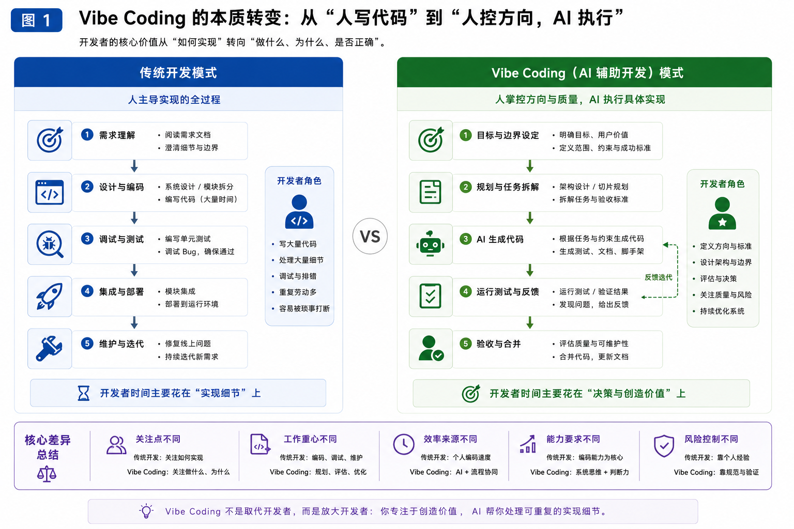
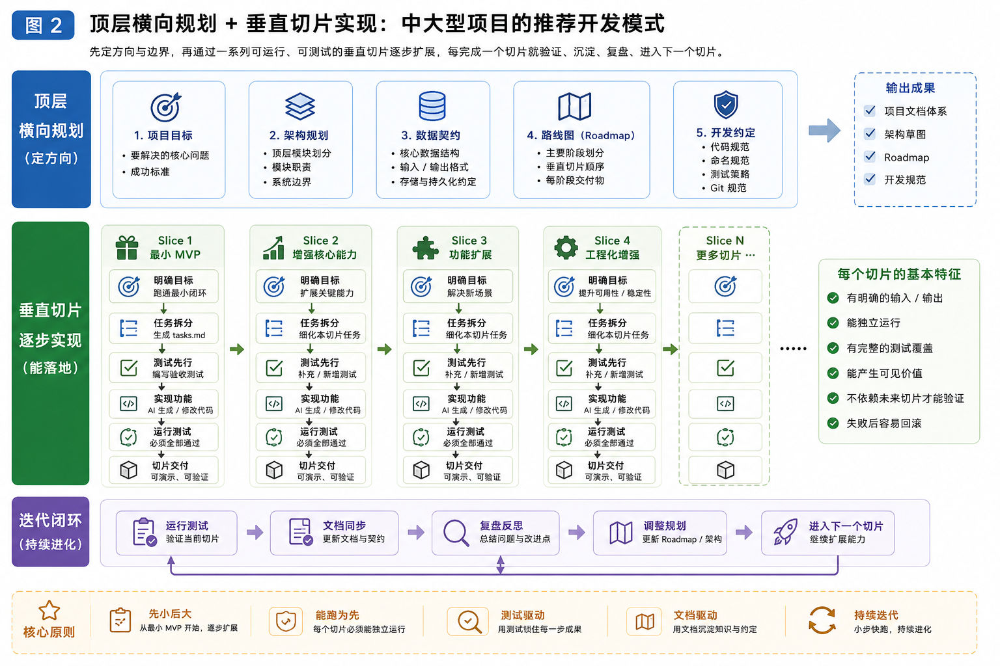
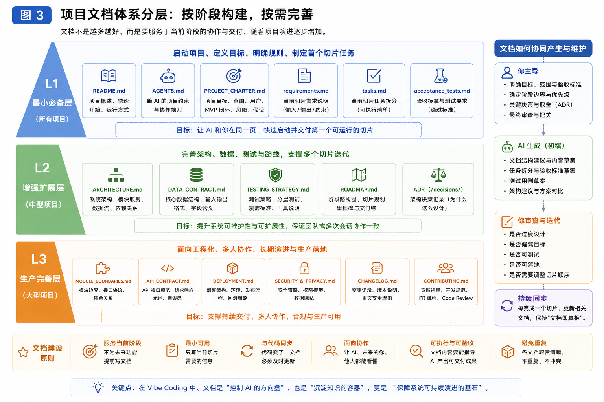
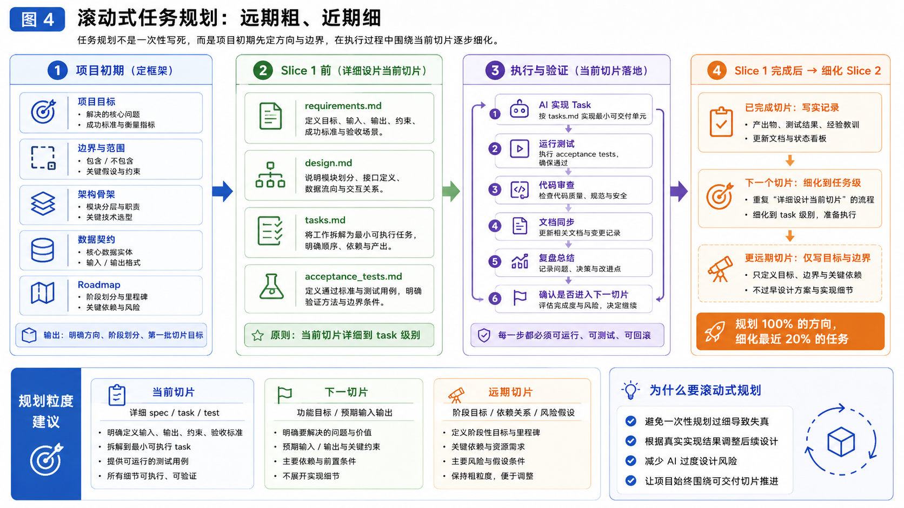
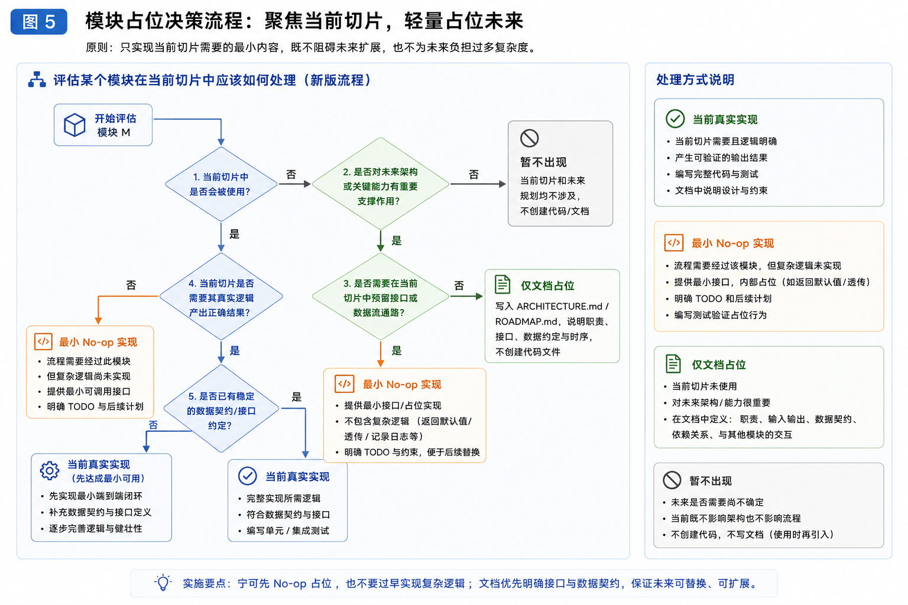
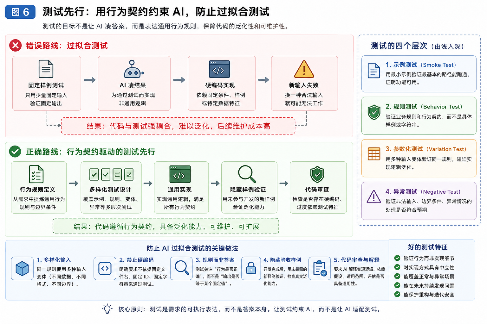
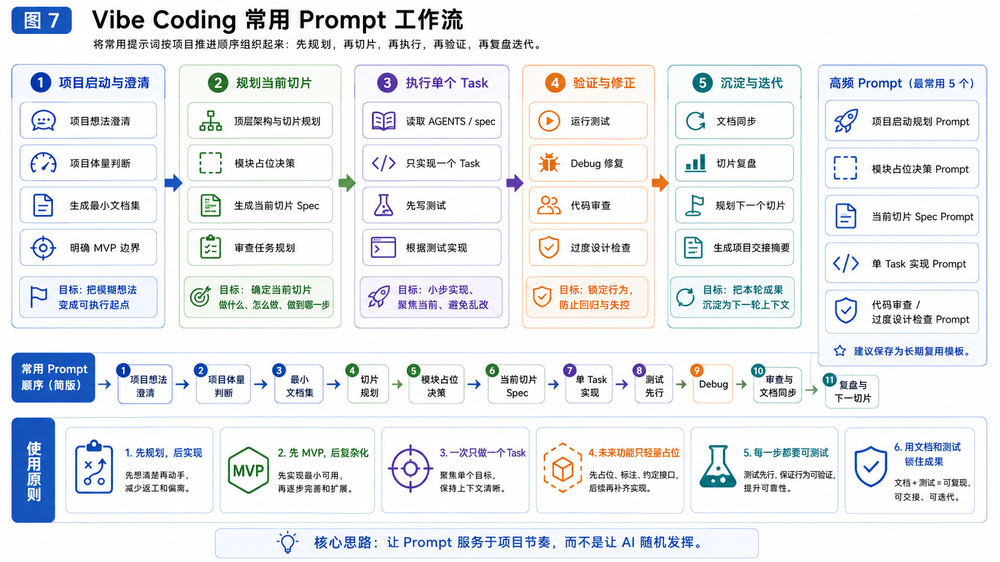

# VibeCoding相关知识可视化

## 图 1：Vibe Coding 的本质转变

**主题：从“人写代码”到“人控方向，AI 执行”**

Vibe Coding 不是简单“让 AI 写代码”，而是开发者角色发生变化：

```
传统开发：人写代码、调试、维护
Vibe Coding：人定义目标、边界、验收，AI 生成、修改、调试代码
```




## 图 2：中大型项目的推荐开发模式

**主题：顶层横向规划 + 垂直切片实现**

中大型项目不能纯粹想到哪写到哪，也不能一开始横向铺满所有模块。正确方式是：

```
顶层规划控制方向
垂直切片负责落地
测试锁住每一步
阶段性重构保持可维护
```




## 图 3：项目初期文档体系分层

**主题：哪些文件必须写，哪些 AI 生成，哪些后期再补**

不是所有文档一开始都要写。文档应该按项目规模和阶段逐步增加。




## 图 4：任务规划的滚动式设计

**主题：初期粗规划，执行中逐步细化**

任务规划不是一开始全部写死，而是：

```
远期粗，近期细；
当前切片详细到 task；
后续切片只写目标和边界。
```




## 图 5：模块占位决策流程

**主题：当前切片聚焦实现，未来模块轻量占位**

执行某个垂直切片时，不是把未来所有模块都建出来，也不是完全不考虑未来，而是：

```
当前需要的模块：真实实现
当前流程必须经过但复杂逻辑未做：最小 no-op 实现
未来才需要的模块：仅文档占位
完全无关的模块：暂不出现
```




## 图 6：测试先行与防止过拟合测试

**主题：测试不是让 AI 凑答案，而是表达行为契约**

“先写测试，再写实现”不是让 AI 针对固定样例硬编码，而是先把通用规则写成测试。




## 图 7：Vibe Coding Prompt 使用流程

**主题：项目从 0 到迭代常用 Prompt 顺序**

把前面整理的 prompt 按项目开展顺序串起来。



